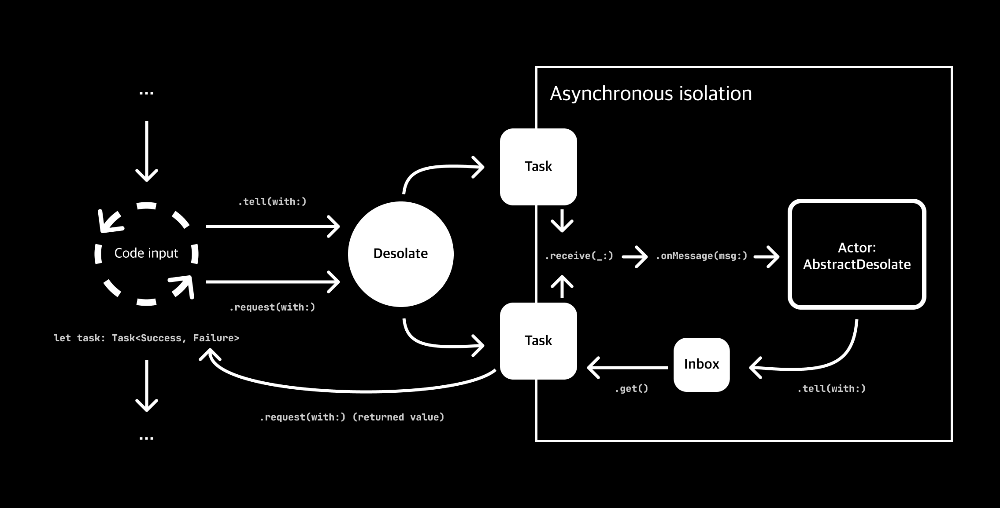

# Understanding Desolate with a Diagram

Diagrams showing how Desolate maintains Actor isolation to better understand how Desolate works.



``Desolate/Desolate`` itself is just a mediator `struct` that have private access to the Actor itself. 
When a line of code in the main thread or any synchronous block call any of the method available from the ``Desolate/Desolate``, it will create a new [`Task`](https://developer.apple.com/documentation/swift/task/) and using unstructured concurrency, run the actor methods asynchronously inside the [`Task`](https://developer.apple.com/documentation/swift/task/). 

Depending on the method called from ``Desolate/Desolate``, the task will just be left to run when appropriate or be returned as value to allow the remaining code to continue while having access to the running [`Task`](https://developer.apple.com/documentation/swift/task/). Now, the name of the package will make sense as the Actor itself is completely isolated.

The actor itself will have to conforms ``Desolate/AbstractDesolate`` which require the ``Desolate/AbstractDesolate/onMessage(msg:)`` asynchronous method. The actor method called by the ``Desolate/Desolate`` is another asynchronous method `receive(msg:)` which add additional functionality in terms of the Desolate status. All of this happened on a running [`Task`](https://developer.apple.com/documentation/swift/task/) which an Actor require methods to be called asynchronously to maintain its isolation.

In cases where the line of code require a result value to be set to a variable or something similar, ``Desolate/Desolate`` will be use what's called an [`AskPattern`](https://doc.akka.io/docs/akka/current/typed/interaction-patterns.html#request-response-with-ask-from-outside-an-actor) which is inspired from the [`akka`](https://akka.io) toolkit.

```swift
extension Desolate {
    var ref: Receiver<ActorType.MessageType> 
}
```

Depending on the where and what's method is called, the return type can vary from a [`Task`](https://developer.apple.com/documentation/swift/task/) for synchronous request, an async throwing result or [`Result`](https://developer.apple.com/documentation/swift/Result) for asynchronous code.

```swift
let desolate = ...

func syncCodeBlock() {
    // Ask for result from Actor, (retry 3 times in cases where value is slow to receive)
    // Synchronous result return the Task itself
    let task: Task<Success, Error> = desolate.request(retry: 3) { .askForResult(receiver: $0)} // <- using the .request given Receiver
}

func asyncCodeBlock() async throws {
    // Asynchronous result can throw an error and result unwrapped Success value
    let successValue: Success = try await desolate.ask(retry: 3) { .askForResult(receiver: $0) } 
    
    // Asynchronous result can also return Result without throwing an error
    let result: Result<Success, Error> = await desolate.query(retry: 3) { .askForResult(receiver: $0) } 
}
```

``Desolate/Desolate`` also implement interaction between actors using `Receiver`, which allow for any actor with the proper message type. 

```swift
actor Actor1: AbstractBehavior, NonStop {
    func onMessage(msg: String) async -> Signal {
        print("Received: \(msg)")
        return same
    }
}

actor Actor2: AbstractBehavior, NonStop {
    func onMessage(msg: (String, Receiver<String>)) async -> Signal {
        let (content, receiver) = msg
        print("Sending \(content)")
        await receiver.task(with: content)
        return same
    }
}

let desolate1 = Desolate(of: Actor1())
let desolate2 = Desolate(of: Actor2())

let desolate1AsReceiver: Receiver<String> = desolate1.ref

desolate2.tell(with: ("From main thread", desolate1AsReceiver))

// prints: "Received: From main thread"
```

In the example above, the main thread also initiated the action but all of the process are running inside a [`Task`](https://developer.apple.com/documentation/swift/task/) and in the actors' isolation, which meant the main thread are free to continue.
